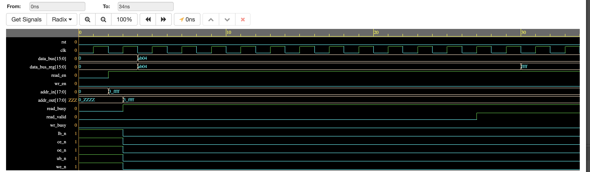

# :speech_balloon: Image Processing SOC Design
Watcelerate is an SOC design targetting the ARM A9 hard processor system on the Altera DE1 board, aimed at accelerating image processing using cores such as edge detection and gaussian blur. 


## :pushpin: Technical Documentation
Contributions to the project are welcome and are accepted for both firmware and for the RTL section of the codebase. 

```verilog
module EdgeDetectionTop (
  input logic clk,
  input logic rst,
  input logic en,
  input logic waitrequest,
  input logic [7:0] pixel,

  output logic readValid,
  output logic sync,                  // Signals the end of column
  output logic  [10:0] pixel_out_x,
  output logic  [10:0] pixel_out_y,    // The pixel being calculated
  output logic  [10:0] next_pixel_x,    // The pixel needed
  output logic  [10:0] next_pixel_y,
  output logic  [10:0] pixel_out
);

```
Currently the Edge detection core is completed however the next step would be to develop a similar core for Gaussian Blur. Similary, an SRAM testbench is also on the TODO list.

```verilog
module AvalonSRAM (
  input logic rst,
  input logic clk,
  input logic read_n,       
  input logic write_n,
  input logic [31:0] address,
  output logic [15:0] readData,
  input logic [15:0] writeData,
  input logic [1:0] byteEnable_n,
  
  output logic waitrequest,          // Signals for burst support
  output logic readdatavalid,

  inout logic [15:0] dq_sram,             // Signals intended for SRAM
  output logic [17:0] address_sram,
  output logic ce_n_sram, oe_n_sram, we_n_sram, lb_n_sram, ub_n_sram
);
```
This would include verification for pipelined trasnfers alongside single address access. 

Here is a snapshot of the current SRAM waveform.


## :hammer_and_wrench: Contributing to the project
If you would like to contribute to the project, feel free to create a pull request. Make sure that all documentation is present for any changes.  
## :scroll: License
The library is licensed under <kbd>GNU GENERAL PUBLIC LICENSE</kbd>